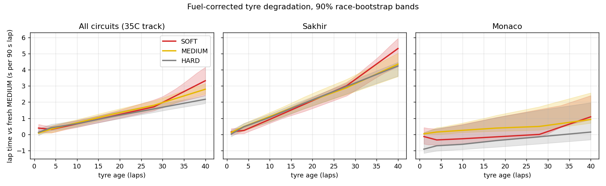

# Pitwall: F1 lap-time, tyre-degradation and pit-stop decision engine

An end-to-end pipeline on every Formula 1 race from 2021 to 2025 ([FastF1](https://docs.fastf1.dev/) data) that

1. **predicts lap times** from the race conditions (circuit, driver, compound, tyre age, fuel load, track temperature, traffic),
2. **models tyre degradation** per compound, per circuit and per race, corrected for fuel burn,
3. **measures what a pit stop costs** per circuit, under green flag, Safety Car and VSC,
4. **decides whether to pit now**, using a dynamic programme over the rest of the race that knows a Safety Car may come,

and evaluates all of it honestly: fitted on 2021-2023, tuned on 2024, tested once on the 24 races of 2025.



**Live app: https://b25bb1004-wq.github.io/F1-Pitstop_Strategy/** (installable as an app on phone or desktop)

- **Intro:** the five start lights fill as the data loads. The car scans in from an amber hologram, then lights out and launch.
- **Pit Wall:** set any race state and get the call as team radio. A 3D car in the garage swaps tyres when the call is BOX. You also get 30-model agreement, the optimal strategy strip and the pit window.
- **Race Theatre:** every 2025 race replayed on the real circuit in 3D, with true elevation from position telemetry. All 20 cars run at their recorded pace. Follow any driver with a chase, helicopter or overview camera, while a timing tower shows the pit-call model's probability against the stops teams actually made.
- **Tyre Lab:** fuel-corrected degradation by circuit and track temperature, plus measured pit loss for 26 circuits.
- **Proof:** the full held-out 2025 evaluation and the comparison with published models.

The browser runs the same optimiser as the Python package, and `tests/test_web_core.py` checks they agree.

## Quick start

```bash
pip install -e ".[test]"          # installs the `pitwall` command
pitwall decide  --circuit Sakhir --lap 14 --compound soft --age 13
pitwall decide  --circuit Sakhir --lap 14 --compound soft --age 13 --status sc
pitwall predict --circuit Monza --lap 30 --compound hard --age 12 --gap 0.8
pytest -q                          # strategy behaviour, physics recovery, JS/Python parity

./run_pipeline.sh                  # full rebuild from the FastF1 cache (offline, ~15 min)
pitwall replay --race 2025_04 --driver NOR
```

```
Sakhir  lap 14/57  SOFT age 13  track GREEN  28C
  decision           : STAY OUT
  pit-now vs stay    : -2.69 s expected (positive = pitting now is faster)
  P(pit now optimal) : 0% over 30 bootstrap models
  pit loss (s)       : green 24.1, SC 12.1, VSC 14.2
  optimal plan       : lap 20 -> SOFT, lap 39 -> HARD
```

## Results (2025 season, never seen during fitting or tuning)

Full tables: [`reports/RESULTS.md`](reports/RESULTS.md), generated from `reports/metrics.json`.

**Lap-time prediction during a race** (at laps 5, 10, 15, ... the model sees only laps already driven and predicts every remaining clean lap; 109,883 predictions):

| Model | MAE, all horizons | 1-5 laps ahead | 21+ laps ahead |
|---|---|---|---|
| Last lap repeated | 1.111 s | 0.536 s | 1.519 s |
| Mean of last 5 laps | 1.148 s | 0.581 s | 1.570 s |
| Linear model fitted on the race's own laps (the usual public approach) | 2.549 s | 0.607 s | 4.508 s |
| **Pitwall structural model** | **0.616 s** | **0.446 s** | **0.723 s** |

**Lap time before the race** (no laps of the race seen): MAE **1.556 s** (R2 0.955) vs 1.708 s for this repo's v1 Ridge.
**Pit loss:** MAE **1.53 s** per stop on 465 green-flag stops (a fixed 22 s gives 2.16 s).
**Race simulation:** from lap 10, predicted time over each finisher's remaining green laps and stops is within **20.0 s (0.49%)**; naive pace x laps is 54.3 s (1.32%).

**Pit calls vs what the teams actually did** (22,331 lap states, 625 real stops; every input is known before the lap except in the last row):

| Model | F1 (exact lap) | F1 (within 2 laps) | PR-AUC | ROC-AUC |
|---|---|---|---|---|
| Optimiser alone (time-minimising, no imitation) | 0.16 | 0.33 | n/a | n/a |
| Classifier on tyre and race state | 0.19 | 0.40 | 0.182 | 0.844 |
| **Pitwall pit-call model** (+ rivals, rejoin traffic, field stops) | **0.27** | **0.45** | **0.245** | **0.876** |
| Same classifier given the current lap's time (leaks the in-lap) | 0.84 | 0.85 | 0.911 | 0.994 |

## How it compares with existing work

| Work | What it reports | Comparable Pitwall number |
|---|---|---|
| This repo, v1 (Ridge, `scripts/`) | pre-race MAE 1.708 s | **1.556 s** pre-race, **0.616 s** in-race |
| Public FastF1 lap-time repos ([f1-strategy-predictor](https://github.com/joodta11/f1-strategy-predictor), [f1-laptime-predictor](https://github.com/derkaisermx5/f1-laptime-predictor)) | 0.29-0.57 s and 0.33-0.37 s MAE, on 1-3 races, with laps or stints of the *same race* in training | **0.446 s** forecasting 1-5 laps ahead across all 24 races of an unseen season; their method as a forecaster: 2.549 s |
| Bi-LSTM pit-stop predictor ([Frontiers in AI, 2025](https://pmc.ncbi.nlm.nih.gov/articles/PMC12626961/)) | per-lap F1 0.81, ROC-AUC 0.988 | 0.27 / 0.876 with information available before the lap; **0.84 / 0.994** once the current lap's time is allowed |
| Virtual Strategy Engineer ([Heilmeier et al., 2020](https://www.mdpi.com/2076-3417/10/21/7805)) | neural nets that imitate pit decisions inside a race simulator | an explicit optimiser for "should", plus an imitation model for "will" |

A classifier that sees the lap's own time reproduces the published per-lap pit scores, because an in-lap is slow *because* the car is entering the pit lane. Without that leak, the same model on the same seasons scores F1 about 0.27. My read is that very high per-lap pit scores mostly measure that leak [Likely; the paper's exact feature list was not checked line by line]. While building v2 I found and removed a smaller version of the same leak in my own baselines (gap and position taken at the end of the current lap); the numbers above are after that fix.

## How it works

```
cache/ (FastF1, offline)
  -> pitwall/build.py       every lap of every 2021-2025 race incl. in/out and SC laps, weather, results
  -> pitwall/features.py    fuel load, stint, traffic gaps, track status, representative-lap filter
  -> pitwall/structural.py  lap-time model (below), one penalised least-squares fit + in-race refits
  -> pitwall/pitstops.py    measured pit loss per circuit; SC/VSC Markov chain per circuit
  -> pitwall/strategy.py    stochastic DP over the rest of the race -> pit now / stay out
  -> pitwall/tune.py        decision parameters chosen on 2024 only
  -> pitwall/evaluate.py    held-out evaluation + baselines -> reports/metrics.json
  -> pitwall/train.py       final fit on all seasons + 30 race-bootstrap refits -> models/pitwall.pkl
```

**Lap-time model.** Lap time = driver-race base pace + compound offset + fuel x 0.033 s/kg + tyre curve(age) + wear-rate deviations for the circuit and the race + temperature x age + traffic + cold-tyre and opening-lap terms. Every term is scaled by the circuit's lap length, so Monaco and Spa share one set of physics. Because each driver's race gets its own base pace, degradation and fuel are learned only from variation *within* a race. That is what fixes v1's problem, where R2 0.91 came almost entirely from knowing the circuit. Fuel and tyre age both rise linearly inside a stint, so they are separated by the stint boundaries (tyre age resets, fuel keeps falling). Circuit- and race-level terms are shrunk toward the global curve, so thin data cannot produce wild curves. During a race, the race-level terms (base pace, compound offsets, wear rate) are re-solved from the laps seen so far, with recent laps weighted most (5-lap half-life, chosen on 2024; it cut in-race error by 18%).

**Pit loss** is measured, not assumed: (in-lap + out-lap) minus what the model says those laps would have taken without a stop. Under a Safety Car the queue closes most of the pit-lane deficit, so SC and VSC stops are measured by gap to the leader three laps later, against non-stopping cars that started from the same gap. In pure time an SC stop costs 9% of a green stop, and a VSC stop 59%.

**Decision.** At the start of lap n, the state is (compound, tyre age, two-compound rule met, track status). The DP minimises expected remaining time over all future stop laps and compounds, with the circuit's per-lap SC/VSC risk built in (about 1.2% and 0.9% per lap on average). So it values staying out for a possible cheap stop. Two parameters were set on 2024 only: in-race wear-rate updates are shrunk hard, and an SC stop is treated as costing 50% of a green stop. Teams behave as if track position given away under the SC is worth far more than the time.

## What the model learned (all seasons)

- **Fuel:** 0.033 s per kg per 90 s lap, so about 0.058 s per lap of fuel burned. This matches published F1 fuel-effect estimates.
- **Degradation (fuel-corrected, average circuit):** SOFT +0.26 / +0.87 / +1.72 s at ages 10/20/30. MEDIUM +0.73 / +1.34 / +2.00. HARD +0.55 / +1.08 / +1.59. Bahrain wears about 0.1 s/lap; Monaco is nearly flat.
- **Traffic:** running within 1 s of the car ahead costs 0.41 s per lap, and 1-2 s behind costs 0.20 s.
- **Pit loss:** median 22.6 s (Silverstone ~21, Bahrain ~24, Singapore ~31; see `reports/figures/pit_loss_by_circuit.png`).

## Limitations

- **Time vs teams:** the optimiser minimises the car's own race time. Undercuts, covering rivals, track position and limited tyre sets are why it agrees with team calls far less than the imitation models do. The pit-call model is the one to use for "what will the team do".
- **Survivorship:** stints that degrade badly get pitted early, so very old tyres are seen mostly on cars where they held up. Beyond the 95th-percentile stint length the optimiser adds a cliff penalty instead of trusting the extrapolation.
- **Compound labels:** SOFT/MEDIUM/HARD are relative per event (C1-C5 allocation is not in FastF1). Circuit-level offsets absorb most of that, but the compound curves overlap.
- **Wet races are excluded** from fitting and decisions (inters/wets on more than 2% of laps).
- **Pre-race prediction** still errs by about 1.5 s, because a new season's car pace is the dominant unknown. In-race calibration removes most of it.

## Repository layout

```
pitwall/              the v2 pipeline (above) + cli.py, figures.py, report.py, export_web.py
web/                  the app (Vite + React + react-three-fiber + GSAP, PWA): src/core/pitwall-core.js is the optimiser
                      port; DESIGN.md; tools/optimize-car.mjs; deployed to GitHub Pages by .github/workflows/pages.yml
tests/                pytest: strategy behaviour, physics recovery on synthetic races, JS/Python parity
models/               pitwall.pkl (final fitted bundle), pitwall_summary.json (readable parameters)
reports/              RESULTS.md, metrics.json, decision_tuning_dev.csv, figures/
notes/                build history and experiment write-ups; v2 write-up in notes/pitwall_v2_report.md
scripts/              v1 pipeline and notebook (kept for history; see notes/)
data/, cache/         gitignored; rebuilt by scripts/data_pull.py (cache) and pitwall/build.py
```

## History

v1 (`scripts/`, July-Sep 2026) built the FastF1 data pipeline and found, through a series of ablations, that an absolute-lap-time Ridge was mostly a circuit lookup. It recovered the first physically sensible degradation numbers with stint- and fuel-aware models. The earlier README concluded that tyre degradation was barely recoverable; the v2 structural model shows that conclusion was wrong. Degradation, fuel and pit loss are all recoverable once base pace is modelled per driver-race and pit/SC laps are kept in the data. See [`notes/pitwall_v2_report.md`](notes/pitwall_v2_report.md) for the full write-up, including three bugs found along the way.

## Credits

- Car model: ["Ferrari F1-75"](https://sketchfab.com/3d-models/ferrari-f1-75-06454e0f23a44fcdabcc7808aee6caf9) by [Sketcher](https://sketchfab.com/sketcher987654321), [CC-BY-NC-4.0](http://creativecommons.org/licenses/by-nc/4.0/). Geometry compressed. Livery, sponsor decals, badges and tyre print removed, and re-liveried in the app. Non-commercial use only.
- Studio HDRI: [Studio Small 08](https://polyhaven.com/a/studio_small_08), Poly Haven, CC0.
- Timing, telemetry and circuit positions: [FastF1](https://docs.fastf1.dev/). Not affiliated with Formula 1 or any team.
